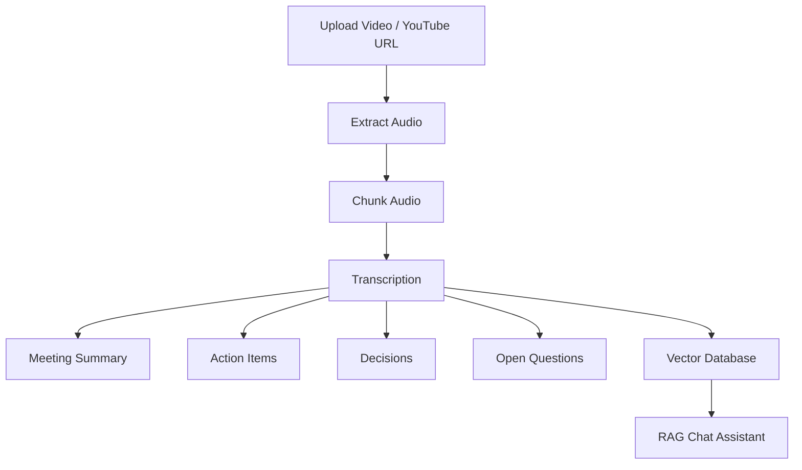

<div align="center">

# 🎙️ Meeting Intelligence AI

### AI-Powered Meeting Assistant for Transcription, Summarization & RAG Chat

<p align="center">
  
  
  
  
</p>

<p align="center">
  Transcribe meetings • Generate summaries • Extract action items • Chat with meetings
</p>

</div>

---

# ✨ Features

## 🎧 Multi-Source Audio Input
- Upload local video/audio files
- Paste YouTube URLs
- Supports:
  - MP4
  - MP3
  - WAV
  - MKV
  - MOV

---

## 🧠 AI-Powered Meeting Analysis

### Automatically Generates:
- 📋 Meeting Summary
- ✅ Action Items
- 🔑 Key Decisions
- ❓ Open Questions
- 🏷️ Meeting Title

---

## 💬 Chat With Your Meeting

Uses **RAG (Retrieval-Augmented Generation)** to ask questions like:

```txt
What decisions were made?
Who is responsible for deployment?
What are the pending tasks?
Summarize the discussion about pricing.
```

---

# 🏗️ Tech Stack

<table>
<tr>
<td><b>Frontend</b></td>
<td>Streamlit</td>
</tr>

<tr>
<td><b>LLM</b></td>
<td>Mistral AI</td>
</tr>

<tr>
<td><b>Transcription</b></td>
<td>Faster Whisper + Groq Whisper API</td>
</tr>

<tr>
<td><b>Hindi Support</b></td>
<td>Sarvam AI</td>
</tr>

<tr>
<td><b>Vector Database</b></td>
<td>ChromaDB</td>
</tr>

<tr>
<td><b>Embeddings</b></td>
<td>Sentence Transformers</td>
</tr>

<tr>
<td><b>Framework</b></td>
<td>LangChain LCEL</td>
</tr>

<tr>
<td><b>Audio Processing</b></td>
<td>FFmpeg + Pydub</td>
</tr>

</table>

---

# 📂 Project Structure

```bash
Meeting-Intelligence-AI/
│
├── app.py
├── main.py
├── requirements.txt
├── .env
│
├── core/
│   ├── transcriber.py
│   ├── summarize.py
│   ├── extractor.py
│   ├── rag_engine.py
│   └── vector_store.py
│
├── utils/
│   └── audio_processor.py
│
├── uploads/
├── downloads/
└── temp_chunks/
```

---

# ⚙️ Installation

## 1️⃣ Clone Repository

```bash
git clone https://github.com/ItsMukundKumar/Meeting-Intelligence-AI.git
cd meeting-intelligence-ai
```

---

## 2️⃣ Create Virtual Environment

### Windows

```bash
python -m venv .venv
.venv\Scripts\activate
```

### Linux / Mac

```bash
python3 -m venv .venv
source .venv/bin/activate
```

---

## 3️⃣ Install Requirements

```bash
pip install -r requirements.txt
```

---

# 🔑 Environment Variables

Create a `.env` file:

```env
MISTRAL_API_KEY=your_key_here

SARVAM_API_KEY=your_key_here

GROQ_API_KEY=your_key_here

USE_GROQ=true

WHISPER_MODEL=base
```

---

# ▶️ Run Application

## Streamlit UI

```bash
streamlit run app.py
```

---

## Terminal Version

```bash
python main.py
```

# 🔄 Workflow



---

# 🌍 Supported Languages

| Language | Engine |
|---|---|
| English | Faster Whisper / Groq |
| Hindi | Sarvam AI |
| Hinglish | Sarvam AI |

---

# 🚀 Deployment

## Streamlit Cloud

1. Push project to GitHub
2. Open Streamlit Cloud
3. Connect repository
4. Add environment variables
5. Deploy

---

# ⚠️ Important Notes

## YouTube Rate Limits

Sometimes YouTube may block requests temporarily.

Possible fixes:
- Use cookies
- Retry after some time
- Use Groq transcription instead of local Whisper

---

## Streamlit Cloud Limits

Heavy transcription models may:
- Increase startup time
- Consume RAM
- Slow deployment

Recommended:
- Use `Groq Whisper API`
- Use smaller Whisper models

---

# 📌 Future Improvements

- [ ] Speaker diarization
- [ ] PDF export
- [ ] Meeting timeline
- [ ] Multi-user chat history
- [ ] Authentication
- [ ] Live meeting transcription
- [ ] Docker deployment

---

# 👨‍💻 Author

### Mukund Shah

<p align="left">
  <a href="https://github.com/ItsMukundKumar/">
    
  </a>
  
  <a href="https://www.linkedin.com/in/mukund-kumar-shah/">
    
  </a>
</p>

---

# ⭐ Support

If you found this project useful:

- Star the repository
- Fork the project
- Share feedback

---

<div align="center">

### Built with LangChain + Streamlit + Mistral AI

</div># Meeting-Intelligence-AI
